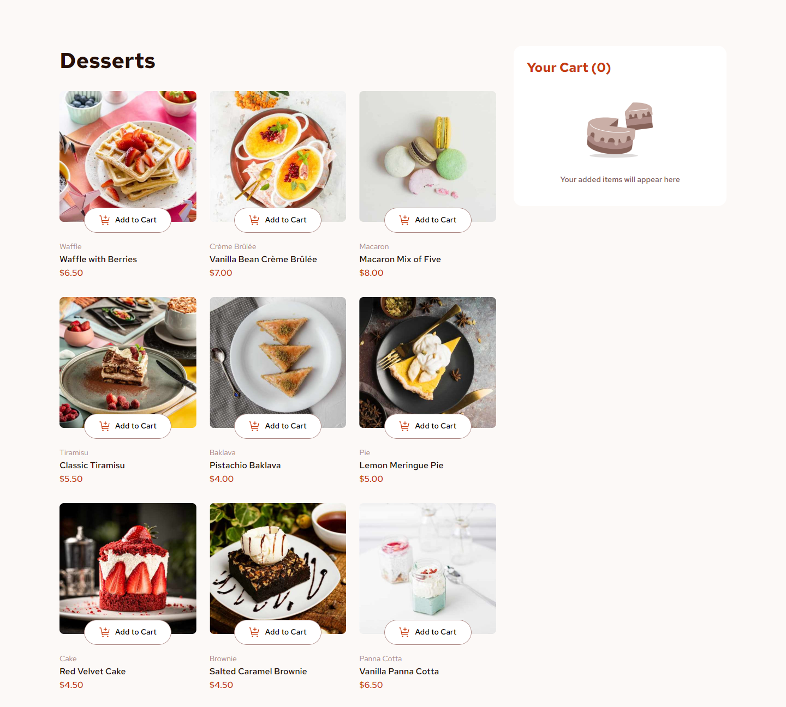
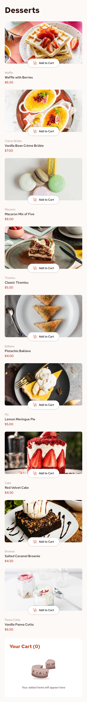

# Product List With Cart

This is a solution to the [Product list with cart challenge on Frontend Mentor](https://www.frontendmentor.io/challenges/product-list-with-cart-5MmqLVAp_d). Frontend Mentor challenges help you improve your coding skills by building realistic projects.

## Table of contents
- [Screenshots](#screenhots)
- [Features](#features)
- [Links](#links)
- [Built with](#built-with)

## Screenshots

Desktop view (1440px)

Mobile view (440px)

## Features

Users should be able to:

- Add items to the cart and remove them
- Increase/decrease the number of items in the cart
- See an order confirmation modal when they click "Confirm Order"
- Reset their selections when they click "Start New Order"
- View the optimal layout for the interface depending on their device's screen size
- See hover and focus states for all interactive elements on the page

## Links
- Live Site URL => https://productlistwithcart-km9.netlify.app

## Built with

- Angular (v17)
- SCSS